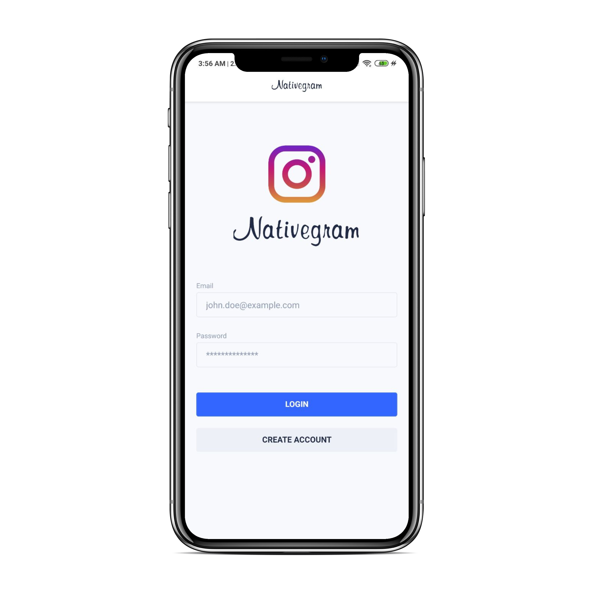
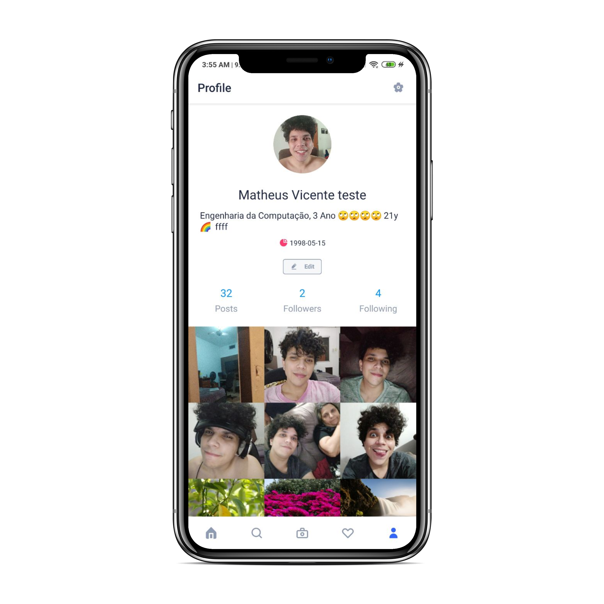

<h1 align="center">
 NativeGram
</h1>

<h3 align="center">
  A social photo sharing app, built with React Native (Instagram Clone)
</h3>
<p align="center">

</p>
<p align="center">
  

  <a href="https://www.linkedin.com/in/matheus-vicente-d-190001b2/" target="_blank" rel="noopener noreferrer">
    
  </a>

  <a href="https://github.com/chamatt/NativeGram/commits/master">
    
  </a>

  <a href="https://github.com/chamatt/NativeGram/issues">
    
  </a>

  
</p>


<p align="center">
  <a href="#-about-the-project">About the project</a>&nbsp;&nbsp;&nbsp;|&nbsp;&nbsp;&nbsp;
  <a href="#-screenshots">Screenshots</a>&nbsp;&nbsp;&nbsp;|&nbsp;&nbsp;&nbsp;
  <a href="#-technologies">Technologies</a>&nbsp;&nbsp;&nbsp;|&nbsp;&nbsp;&nbsp;
  <a href="#-getting-started">Getting started</a>&nbsp;&nbsp;&nbsp;|&nbsp;&nbsp;&nbsp;
  <a href="#-license">License</a>
</p>

## 📔 About the project

A Full Stack Photo-Sharing App, built with React Native + Expo + GraphQL

#### Features:

[✔] Authentication (Login/Register)

[✔] User Profiles

[✔] Image Upload from Gallery

[✔] Take pictures with your phone camera

[✔] Posts

[✔] Posts with multiple images

[✔] Comments

[✔] Likes

[✔] Follower/Following

[✔] A Post Feed with your friend's newest posts

[✔] Global User Search

[✖] Notifications

To see the **back-end API**, built with Strapi CMS, click here: [NativeGram-Backend](https://github.com/chamatt/NativeGram-Backend)<br />

## 📸 Screenshots

A few screenshots from parts of the app:

| Login | Feed  | Camera | Profile | 
|-------|-------|--------|---------|
|  |  |   |    | 

## 🚀 Technologies

Technologies that were used in this application

- [Node.js](https://nodejs.org/en/)
- [React Native](https://reactnative.dev/)
- [Expo](https://expo.io/)
- [Apollo Client](https://www.apollographql.com/docs/react/) [GraphQL Client]
- [React Native](https://reactnative.dev/) 
- [Easy-Peasy Redux](https://github.com/ctrlplusb/easy-peasy) [Cool Redux Abstraction]
- [UI-Kitten](https://akveo.github.io/react-native-ui-kitten/) [UI Component Library]
- [Styled Components](https://styled-components.com/) [Styling Solutioon]
- [React Navigation](https://reactnavigation.org/)

## 💻 Getting started

### Test the live version

If you have an android, you can open the application directly from Expo: [NativeGram](https://expo.io/@chamatt/instagram-clone)

### Or build it yourself

#### Requirements

- [Node.js](https://nodejs.org/en/)
- [Yarn](https://classic.yarnpkg.com/) or [npm](https://www.npmjs.com/)

**Clone the project and access the folder**

```bash
$ git clone https://github.com/chamatt/NativeGram.git && cd NativeGram
```

**Follow the steps below**

```bash
# Install the dependencies
$ yarn

# Run in dev mode
$ yarn start

# The Expo metro bundler will open and let you pick
# how you want to open the app (Android Emulator, IOS Simulator, Web)
# Or you can open directly from your android phone with Expo app

# Well done, project is started!
```

## 📝 License

This project is licensed under the MIT License - see the [LICENSE](LICENSE) file for details.

---
